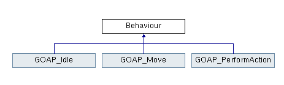

# UE4 GOAP Utility AI

A Goal orientated AI agent running off the State machine from the first weeks tutorial.

# The Base
The GOAP system itself is run from a Finite State Machine (The same one from the first weeks tutorial). It has 3 different behaviours:

#### GOAP Idle
The idle behaviour that runs when the AI Agent has no actions to perform and will constantly run until the Agent formulates a new plan.

#### GOAP Move
The behaviour that moves the agent from their current position to the position that they need to be in, in order to complete their current action.

#### GOAP Perform Action
The behaviour that actually performs the action such as infecting an agent.

# GOAP Agent

# GOAP Actions

# The GOAP Planner
The GOAP Planner that is run in the GOAP_Idle behaviour creates a plan of actions that satisfy an AI Agents goal. It will run through every action that it is able to perform and 