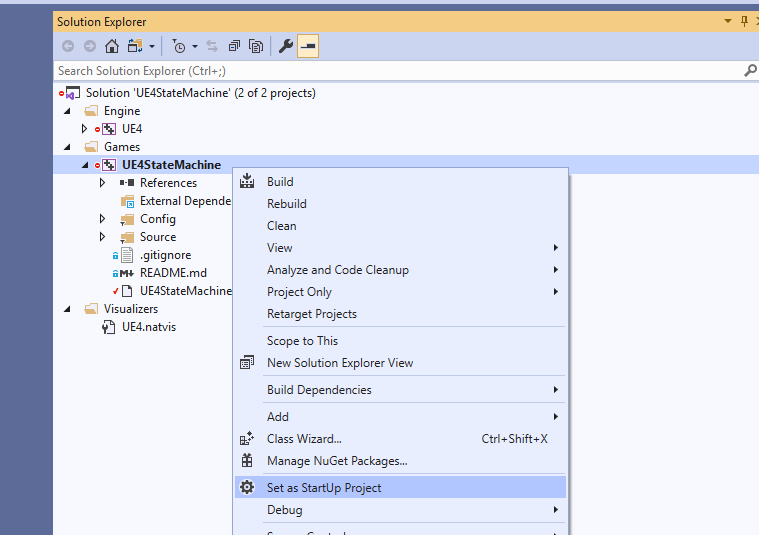
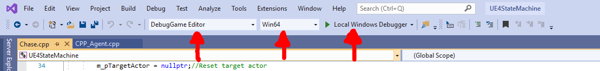
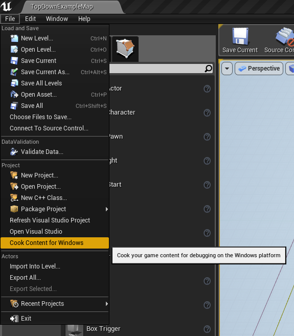
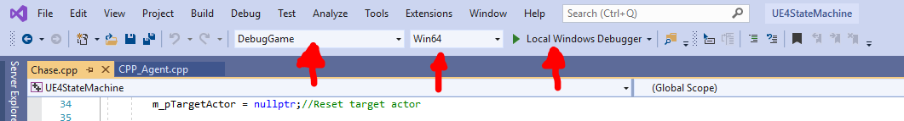

# Opening an Unreal project and using the Visual Studio development environment
Quick setup and guide for using Visual Studio with UE4 for the AI assignment.

## Setting the Project Version
This first step will change the projects directory configurations to match where your Unreal Install is located. Just right click on the project file and click `Switch Unreal Engine Version...`.

Then Select `4.22` from the drop down list, this is the UE4 version required for the assignment.

## Generating the Visual Studio Project
This step is simple, just right click your UE4 project and click `Generate Project files` to generate the Visual Studio Solution for your project.

## Opening the Editor via Visual Studio
Once you have opened your projects Visual Studio Solution, first make sure that your project is selected as the Startup project in the Solution Explorer, just simply Right click your UE4 project and click `Set as Startup Project`.

You can then launch the editor directly from Visual Studio by selecting the `DebugGame Editor` and the `Win64` options for debugging and pressing play.
Once the solution has compiled the editor will open.

## Cooking Content for Windows
This step is important if you wish to run and debug your game without using the editor. 

**You *must* do this step everytime you make changes to your level or they will not be reflected when you run the game directly from Visual studio.**

Firstly, Select the `DebugGame Editor` and the `Win64` options for debugging and press play.

Once the editor has finished opening, head to `File` and click on `Cook Content for Windows`, this will bake your level so that Visual Studio can play the game without having to open the editor each time you want to debug.

## Running the Game without the Editor
Running the game without using the editor will speed up your workflow by quite a bit. This method will just launch a standalone Game client similar to how you did in the High Level Programming Module in Level 5.

Just select `DebugGame` and `Win64` as Debug Options and press play, once compilation has finished, the standalone game client will open. You can also use breakpoints using this method to debug your game.

