# Adding a .gitignore to your Unity repositories
Unity generates a ton of files in your project directories that you don't necessarily need to push to GitHub. Pushing these files can also lead to your repositories growing in size and eventually hitting GitHub's free limits for repos.

This can be solved by adding a gitignore file to your project.

# What is a gitignore?
A gitignore file is a file that is used to tell Git what files it needs to track the changes of. Using them, you can tell git to ignore entire directories that someone else downloading your project doesn't need in order to run/build it.

This greatly decreases the file size of projects when downloading/cloning them from Git, and makes it so you only push what is important (No more pushing 3359 changes in one commit!).

##### For Example
Here is an assignment repository *without* a gitignore file, when cloned to my computer, it is **141mb**, which is made up of **90mb** of assets and **51mb** of project files.

 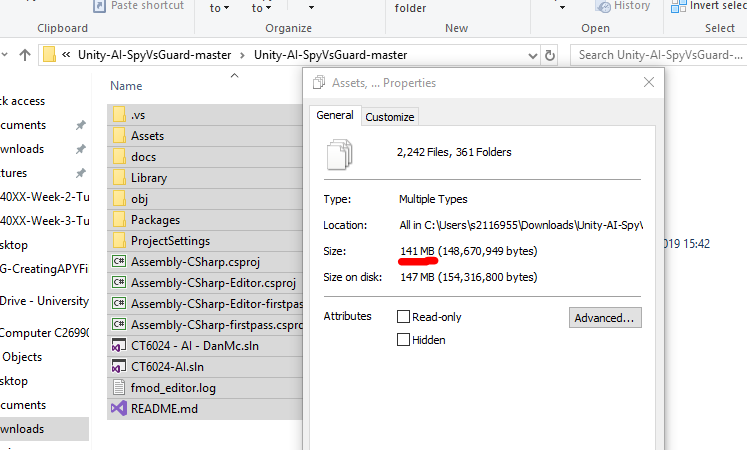

After adding a .gitignore file and removing the tracked files, the new size is **95mb**, which is made up **90mb** of assets and **5mb** of actual project files.

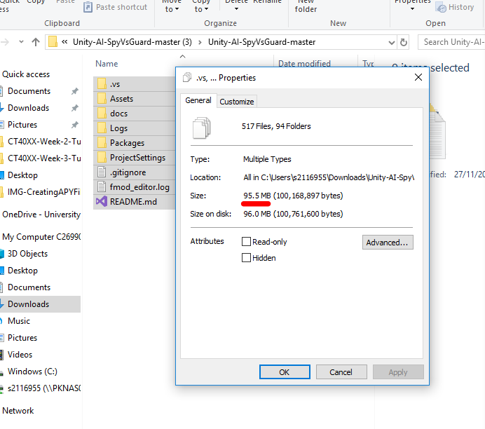

Just by adding one file, I was able to remove **46mb** of junk that Unity generates when you open the project.

# How to actually add the .gitignore
You might have to use a different method depending on if you wish to add the .gitignore to a new or existing repository.

## Adding to a new repository
To add an ignore file to a new repository, just simply download the [Unity Gitignore file here](https://connectglosac-my.sharepoint.com/:u:/g/personal/s2116955_glos_ac_uk/EQrkq5LAY0hKlM05ICVC3sQBFBPCtH2oJNYLQ7ipqW8Iqw?e=b41GZ8), which contains all of the directories and files that Git should ignore for Unity projects.

Once downloaded just simply place it in your repository, Commit and push the changes. Then add your Unity project.

## Adding to an existing Unity Project
If you already have a repository with a Unity project and wish to add an ignore file to it, you will have to go through a few extra steps, but this is worth it in the long run.

### Downloading the .gitignore file
Download the following .gitignore file and place it in the root of your repository (The very start/first folder of your repository).

- [.gitignore Download](https://connectglosac-my.sharepoint.com/:u:/g/personal/s2116955_glos_ac_uk/EQrkq5LAY0hKlM05ICVC3sQBFBPCtH2oJNYLQ7ipqW8Iqw?e=b41GZ8)

### Installing Git
In order to apply the changes of the gitignore to all files across your repository you will need a command line version of Git. For this, I will be using Git Bash, which can be downloaded and installed at [https://git-scm.com/downloads](https://git-scm.com/downloads).

Download the Windows version and follow the installer.

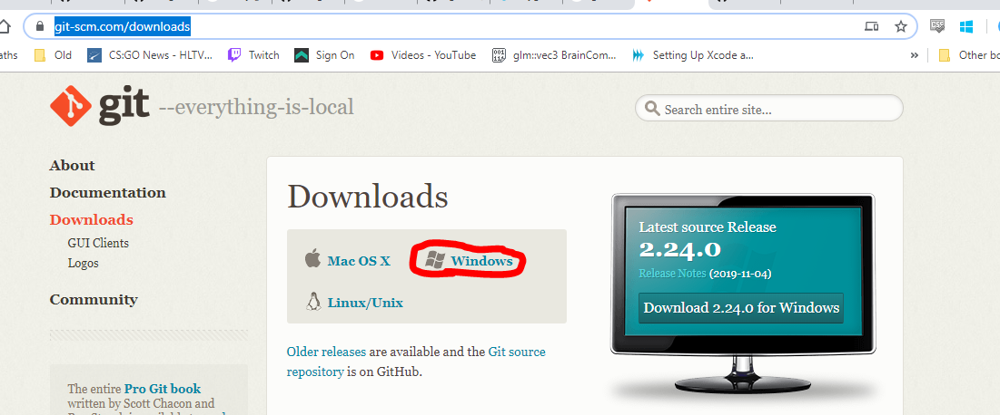

I've included the steps for the installer if you get stuck in the Dropdown below.

<details>
    <summary>Installation Steps</summary>


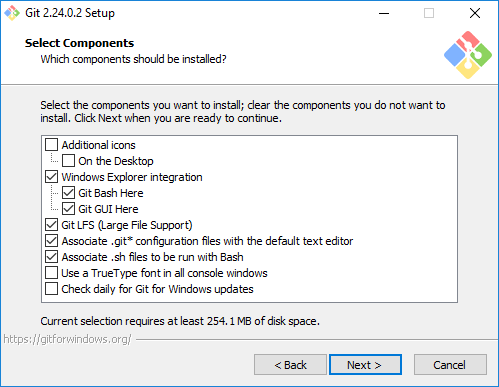

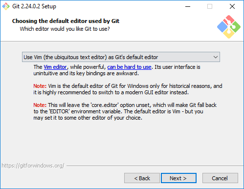

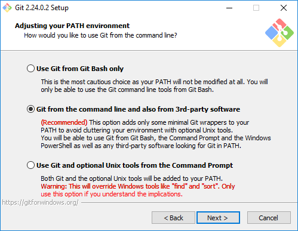

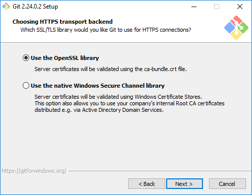

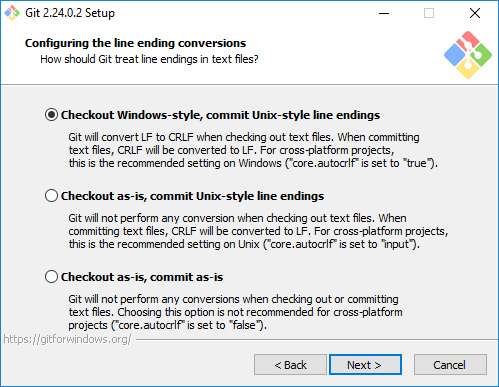

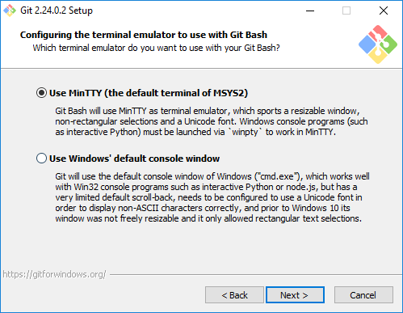

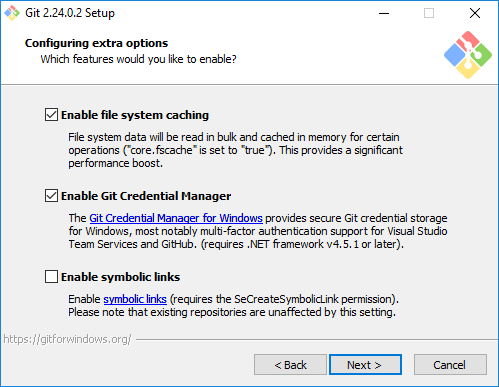

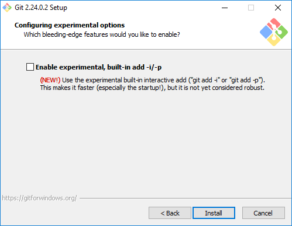


</details>

## Opening the Git Command line
Head to your repository directory, in my case its in my `Documents/GitHub/Unity-AI-SpyvsGuard` directory. (In GitHub Desktop you can hit <kbd>Ctrl</kbd> + <kbd>Shift</kbd> + <kbd>F</kbd> to open the folder!).

Right click and hit `Git Bash Here`, if you cannot see this option you may have to reinstall your computer after installing Git.

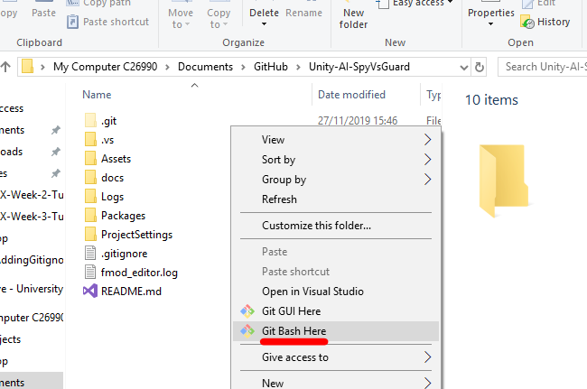

## Account Setup - Windows
Once you have installed Git you will need to configure your GitHub settings so that you can access your repositories and push commits to them. You will need to open a Command Prompt Window or Git Bash, you can find both of these in your start menu. For this tutorial, I will be using Git Bash (Which you installed in the last step).

When you have opened your prefered program you will need to type the following, filling in your GitHub details in place of `YOUR NAME` and `YOUR EMAIL` etc.

```bash
git config --global user.name "YOUR USERNAME"
```

and also:

```bash
git config --global user.email "YOUR EMAIL"
```

## Generating your Keys
You will now need to setup an ssh key so that you can securely connect to GitHub's servers.

Generate a keypair using the following commands:

    ssh-keygen -t rsa -C "YOUR EMAIL"

You then need to copy the contents of your public key (`id_rsa.pub`) file and add it to your GitHub settings, you can do this by right clicking `id_rsa.pub` and opening it with notepad.

- Go to your github Account Settings.
- Click `SSH Keys`.
- Click `Add SSH Key`.
- Add a decriptive name, so that you can recognise where each key is being used

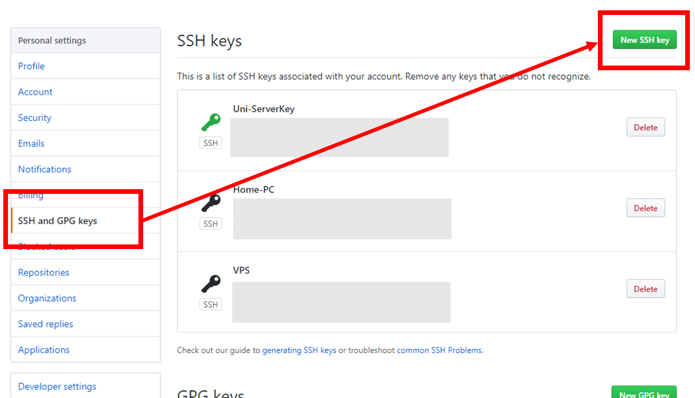

You will then need to test that you have done everything correctly by using the following command:
    
    ssh -T git@github.com

If you get something along the lines of the line below, then you have successfully connected your account to GitHub, you are now ready to use Git on the command line!

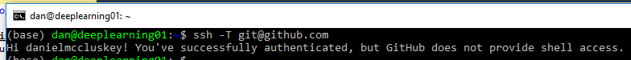

## Removing the Tracked files
The first step is to remove *all* files from the tracked staging area of your repository, we can do this by typing the following command into the Git Bash window and then hit <kbd>Enter</kbd>:

```bash 
git rm -r --cached *
```

## Adding back the necessary files
Now we need to add the necessary files back to the tracking area, type the following command and hit <kbd>Enter</kbd>.

```bash
git add .
```

*The fullstop at the end means "Everything from this directory"*

## Committing this change
Next we can commit these changes to GitHub:

```bash
git commit -m "Added new Gitignore"
```

## Pushing the Changes
Now to Push these changes directly to GitHub:

```bash
git push
```

## Done
Now your repository should be using the GitIgnore!
