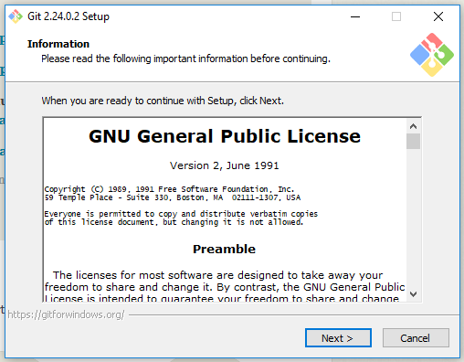

# Adding a .gitignore to your Unity repositories
Unity generates a ton of files in your project directories that you don't necessarily need to push to GitHub. Pushing these files can also lead to your repositories growing in size and eventually hitting GitHub's free limits for repos.

This can be solved by adding a gitignore file to your project.

# What is a gitignore?
A gitignore file is a file that is used to tell Git what files it needs to track the changes of. Using them, you can tell git to ignore entire directories that someone else downloading your project doesn't need in order to run/build it.

This greatly decreases the file size of projects when downloading/cloning them from Git, and makes it so you only push what is important (No more pushing 3359 changes in one commit!).

##### For Example
Here is an assignment repository *without* a gitignore file, when cloned to my computer, it is **141mb**, which is made up of **90mb** of assets and **51mb** of project files.

 

After adding a .gitignore file and removing the tracked files, the new size is **95mb**, which is made up **90mb** of assets and **5mb** of actual project files.

Just by adding one file, I was able to remove **46mb** of junk that Unity generates when you open the project.

# How to actually add the .gitignore
You might have to use a different method depending on if you wish to add the .gitignore to a new or existing repository.

## Adding to a new repository
To add an ignore file to a new repository, just simply download the [Unity Gitignore file here](https://connectglosac-my.sharepoint.com/:u:/g/personal/s2116955_glos_ac_uk/EQrkq5LAY0hKlM05ICVC3sQBFBPCtH2oJNYLQ7ipqW8Iqw?e=b41GZ8), which contains all of the directories and files that Git should ignore for Unity projects.

Once downloaded just simply place it in your repository, Commit and push the changes. Then add your Unity project.

## Adding to an existing Unity Project
If you already have a repository with a Unity project and wish to add an ignore file to it, you will have to go through a few extra steps, but this is worth it in the long run.

### Downloading the .gitignore file
Download the following .gitignore file and place it in the root of your repository (The very start/first folder of your repository).

- [.gitignore Download](https://connectglosac-my.sharepoint.com/:u:/g/personal/s2116955_glos_ac_uk/EQrkq5LAY0hKlM05ICVC3sQBFBPCtH2oJNYLQ7ipqW8Iqw?e=b41GZ8)

### Installing Git
In order to apply the changes of the gitignore to all files across your repository you will need a command line version of Git. For this, I will be using Git Bash, which can be downloaded and installed at [https://git-scm.com/downloads](https://git-scm.com/downloads).

Download the Windows version and follow the installer.

I've included the steps for the installer if you get stuck in the Dropdown below.

    
Installation Steps

## Opening the Git Command line