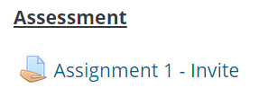
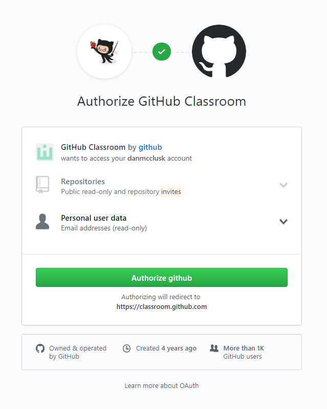
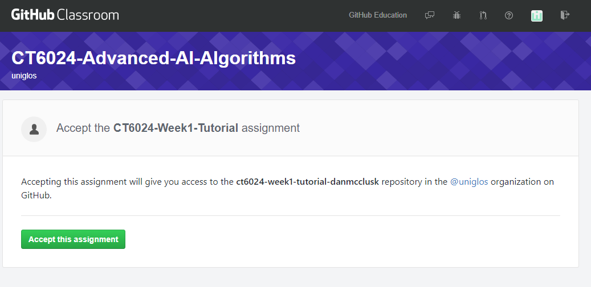

# Accepting a GitHub classroom Assignment

If one of your modules is using GitHub Classrooms as a medium to submit assignments, you will need to accept the invite to that assignment. To do this, you will first need a GitHub Account and then follow the steps below.

## Invite Link
On the Moodle page for your Module, you will see an Invite link to your assignment, click on it to create your personal repository for your assignment. The link will look something along the lines of the image below.

## Authorisation
You will next need to authorise GitHub Classrooms to use your account, do this by simply clicking the green `Authorize github` button.

## Accepting the Assignment
You will then be taken to a screen that asks if you would like to accept the assignment, go ahead and press the green `Accept this assignment button`, a private repository will then be created for you in which you can complete your assignment.

