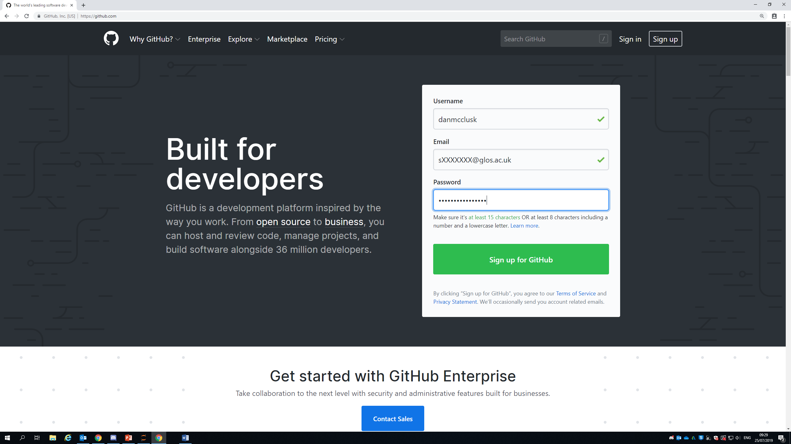
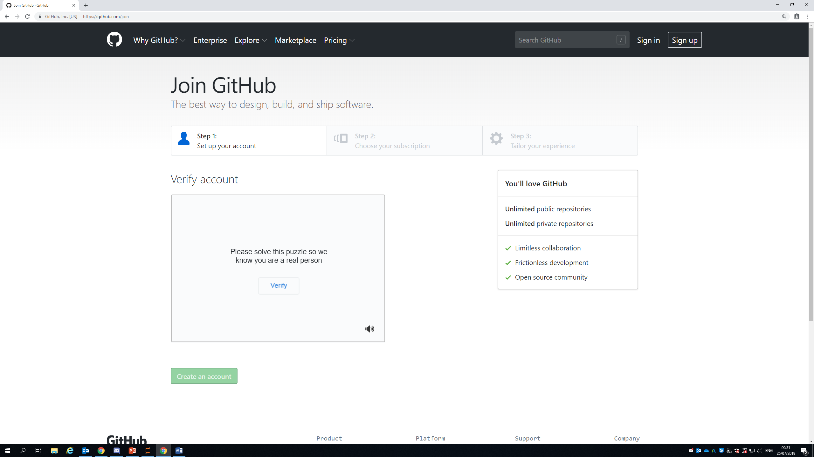
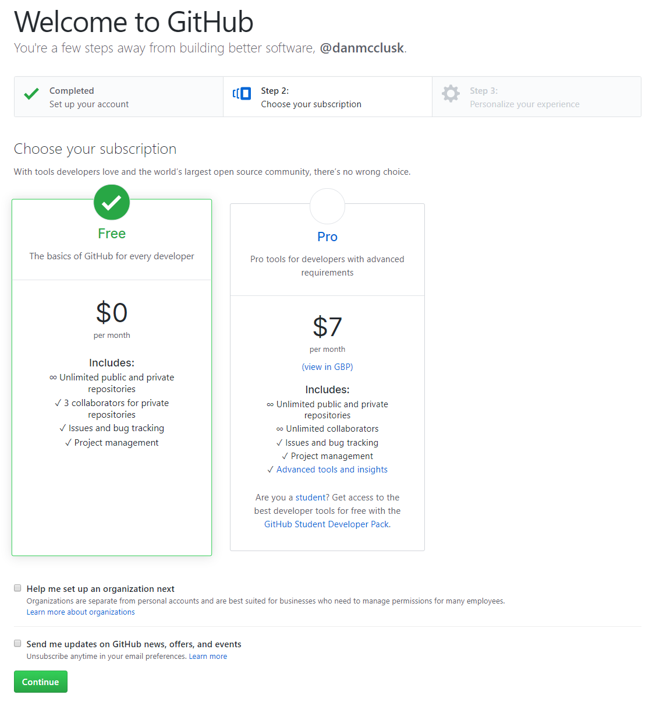
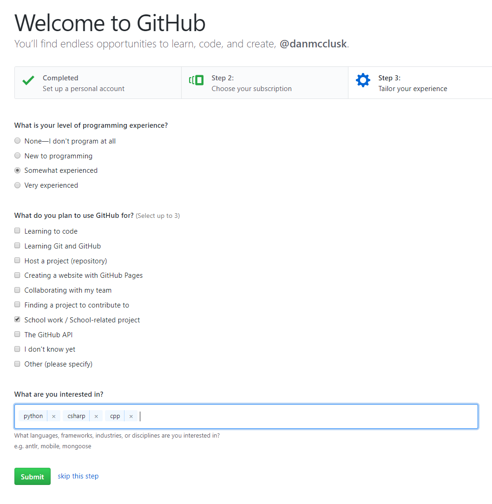
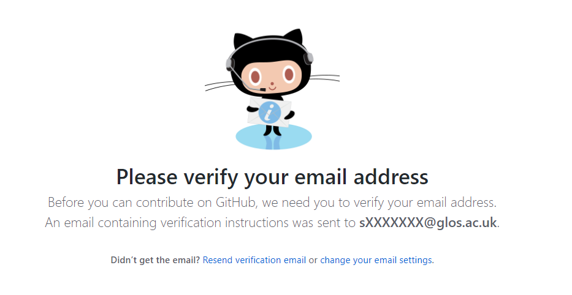

# Setting up a GitHub Account

## Getting Started
First of all you will need to head over to the [GitHub Website](www.github.com) and fill in the `Sign up` form.

- You should use an appropriate username e.g. A combination of your first and last name, I have used `danmcclusk`. This is so we can identify who the account belongs to when marking assignments, it is also more professional than using a name such as `BurntToast42`.
- You should use your student email address, this will allow us to find your account and will give you access to the GitHub Education pack which we will go over later.

## Verification
GitHub will then ask you to go through a quick verification stage to make sure you're not a robot.

## Choosing a Subscription
Make sure to choose the `Free Subscription` as we will automatically get the `Pro subscription` for free in a later step when we setup a GitHub Education account.

## Interests
You can either skip this step or complete it to get tailored articles and repositories shown to you on your GitHub Dashboard.

## Verification
You will now need to verify your email address, you can do this by going to your [MyGlos Dashboard](http://my.glos.ac.uk) and clicking on Emails.

## Student Deals
If you head over to the [Github Education](https://education.github.com/students) website and sign up for their Education Pack using your student email, you will gain access to tonnes of features such as GitHub Pro for free.
Just click on the `Get Benefits for Students` button and follow the on-screen instructions.

 