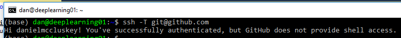

# Setting up Git for use on the Command line
This guide will give a brief overview of how to download and use Git on the command line, which is useful for controlling versions of your working directories on servers etc.

## Making an Account
For this tutorial, you will need a GitHub account, [click here](https://github.com/) to go to the GitHub website and create an account. When creating the account make sure that:
- The username you choose is professional.
  -  You may want to use this account as a host for your portfolio pieces in the future, and a name like `ChocolateDigestive532` wouldn't send the right message to an employer.
  -  Try a combination of your First and Last name.
- That you use a professional email.
  - For the same reasons mentioned above.

## Download
First of all, you will need to download and install Git which you can do by [clicking here](https://git-scm.com/downloads). Once you have downloaded it, open the installer and follow the instructions.

## Account Setup - Windows
Once you have installed Git you will need to configure your GitHub settings so that you can access your repositories and push commits to them. You will need to open a Command Prompt Window or Git Bash, you can find both of these in your start menu. For this tutorial, I will be using Git Bash (Which you installed in the last step).

When you have opened your prefered program you will need to type the following, filling in your GitHub details in place of `YOUR NAME` and `YOUR EMAIL` etc.

    git config --global user.name "YOUR USERNAME"
    git config --global user.email "YOUR EMAIL"

## Generating your Keys
You will now need to setup an ssh key so that you can securely connect to GitHub's servers.
First check that you haven't already got an SSH Keypair by going to `C:\Users\YOURACCOUNT\.ssh`. If this folder exists AND it contains an `id_rsa` file and a `id_rsa.pub` file, then you can skip the next step about generating one.

Generate a keypair using the following commands:

    ssh-keygen -t rsa -C "YOUR EMAIL"

You then need to copy the contents of your public key (`id_rsa.pub`) file and add it to your GitHub settings, you can do this by right clicking `id_rsa.pub` and opening it with notepad.

- Go to your github Account Settings.
- Click `SSH Keys`.
- Click `Add SSH Key`.
- Add a decriptive name, so that you can recognise where each key is being used

You will then need to test that you have done everything correctly by using the following command:
    
    ssh -T git@github.com

If you get something along the lines of the line below, then you have successfully connected your account to GitHub, you are now ready to use Git on the command line!

