# Using Git on the Command line
This guide will give a brief overview of how to use Git on the command line, which is useful for controlling versions of your working directories on servers etc.

## Setting up Git
If you have not yet setup Git for use on the command line, you will need to follow the following tutorial.

https://github.com/danielmccluskey/CT40XX-Tutorials/blob/master/Generic/How-To-Setup-Git-CMDLine.md

## Ways to use Git
There are many ways that you can use Git on the Command line, here are a few of the more common options:

#

#### Windows Command Prompt
Once you have installed Git to Windows, you can start using it via the Windows Command Prompt. To open it, you can either:
- Type `cmd` into the Windows start menu search bar
- Hit <kbd>Windows Key</kbd> + <kbd>R</kbd>, to open the *Run Window*. Then type `cmd.exe` and hit *Run*

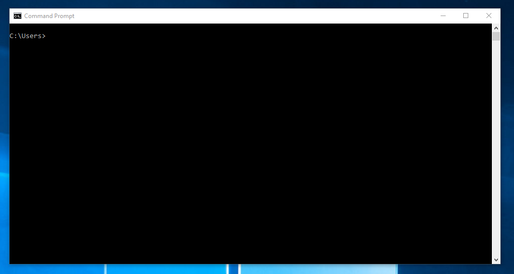

#

#### Windows Powershell
The Powershell is very similar to the Command Prompt and can be opened in the following ways.
- Type `powershell` into the Windows start menu search bar
- Hit <kbd>Shift</kbd> + <kbd>Right Click</kbd> when in any Windows Explorer window and click *Open Powershell Window here*
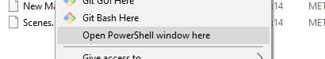

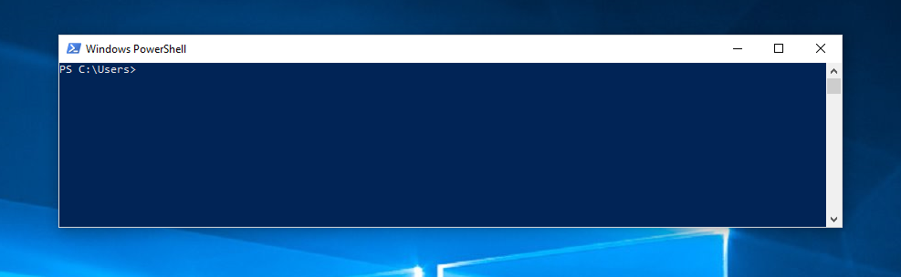

#

#### Git Bash
Git Bash is an optional install that you can choose to install when you install Git. You can open it by:
- Type `git bash` into the Windows start menu search bar
- Hit <kbd>Shift</kbd> + <kbd>Right Click</kbd> when in any Windows Explorer window and click *Git Bash here*
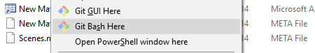

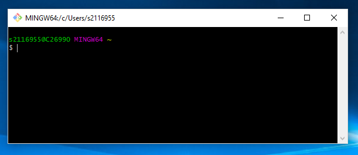

## Getting to the right place
To keep your repositories organised, you should move the command prompt to target a specific folder which contains all of your repositories. You can do this by using the `cd` command, which stands for *Change Directory*. You can either paste a file path after the command or just put one folder at a time.

The following command can be used to go directly to a specific folder.

    cd "C:/Users/UserName/Documents/GitHub/"

Or you can use a series of commands to get to where you want. 

    cd Users
    cd UserName
    cd Documents/GitHub

## Creating a Repository
There are two main methods that you can use to create a repository. You can either create a local repository on your machine or you can clone one from the internet.

#

### git init
This will create a new local repository on your machine which is completely empty.

    git init REPOSITORYNAME

#

### git clone
This will copy a repository from a URL to your machine where you can then edit the files.

    git clone URL

Cloning a repository from GitHub is as simple as:
- Going to the repository you wish to clone on the [GitHub website](http://www.github.com).
- Click on the Green clone button.
- Click `Use HTTPS`
- Copy the URL it gives you
- Type `git clone` followed by the URL you copied and hit Enter.
- You should then move into the folder you just cloned, so in this case I would type `cd Unity-NeuralNetworkSideScroller`.
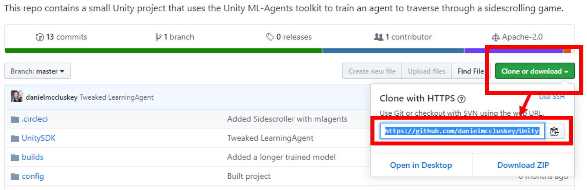

E.g.

    git clone https://github.com/danielmccluskey/Unity-NeuralNetworkSideScroller.git

## Using Git
Now that we've got our repository cloned and ready we can now get to work. Once you have edited some files, you might want to start **committing** your work.

#

### git add
You can use `git add` to add changes in your working directory to your staging area. Only *Staged* files will be saved and tracked when you commit, so if you do not stage a file, Git will not track the changes through version control.

- `git add -p` can be used to add all files to the staging area
- `git add FileName` can be used to add a specific file to the staging area
- `git add <Folder>` can be used to add all files in a specific folder to the staging area

#

### git commit
Together, this command and `git add` are the most frequently used commands. Using `git commit` will save a snapshot of your *Staged area* (All of the files you have used `git add` on). You can then revert to this snapshot at a later time. It is important to commit your work at regular intervals or everytime you make a significant change to your project so that you do not lose to much progress if you need to revert. 

It is also important that when you commit, you provide it with an informative title and description of what has changed since the last commit. If you do not use informative titles and descriptions, you will find it difficult to find which commit to use in the event you need to revert your changes.

###### Committing
To commit, you first need to add some files to your staging area, otherwise you will get the following:
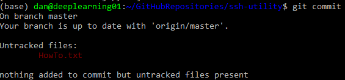

To add the files use the `git add` command.

    git add HowTo.txt

That file is now in our Staging area, we can now create a commit. When you write `git commit` you will be taken to a text editor, where you can write the description for the commit, but sometimes it is easier to use the `-m` flag, which allows you to just write out the message inline. For example:
    
    git commit -m "Added How To text file!"

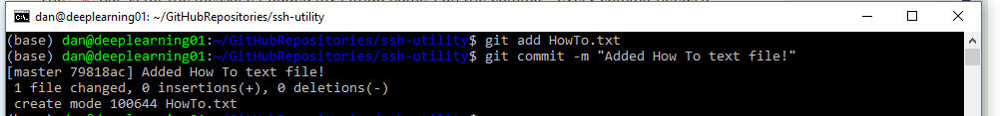

You have now committed and the snapshot of your workspace has been saved! The next step is to *push* the commits to GitHub...

#

### git push
You can use `git push` to *push* your commits from a local repository to a remote repository. In our case it would be to push the commits that we have made on our local machine to GitHub so that our work is saved remotely and we can access it on other machines.

Once we have made one, or multiple commits we can push our work to Github:
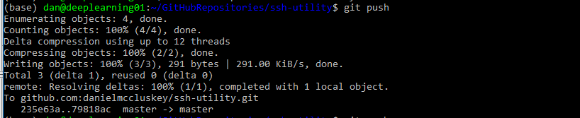

Once the process has completed we can go to our Repository on GitHub to see if it worked!

#

### git status
This will show you the *status* of your local repository. It will tell you what files have changed in your working directory and which ones you have or haven't added to your staging area. It will also tell you how many commits you haven't pushed or if there are any commits to *pull* from GitHub.

Here is an example of what is returned when we *add* a modified file to our staging area and use the `git status` command:
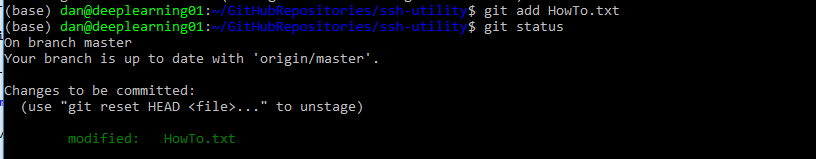

It will also tell you when you have commits on your local machine that have not been synced with the repository on GitHub *(Meaning you need to `git push`!)*
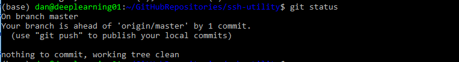

#

### git pull

#### git diff

#### git reset

## Using Branches

