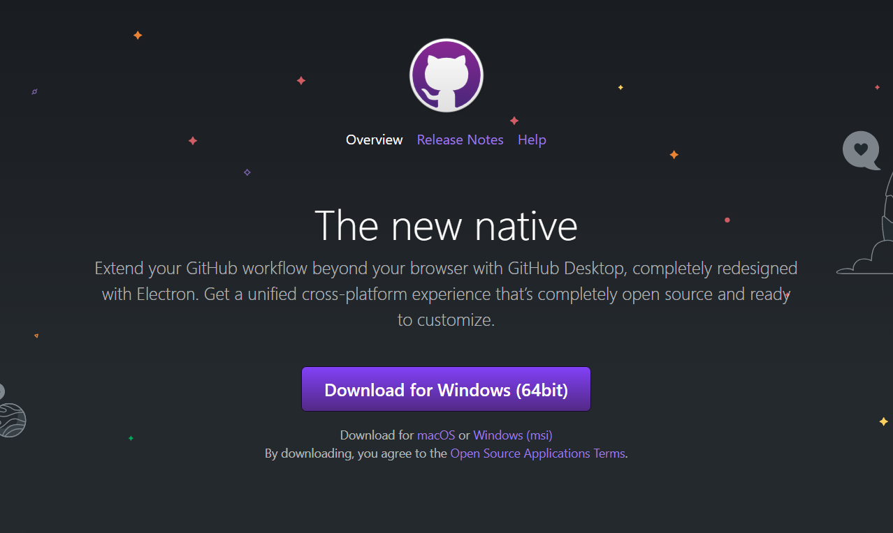
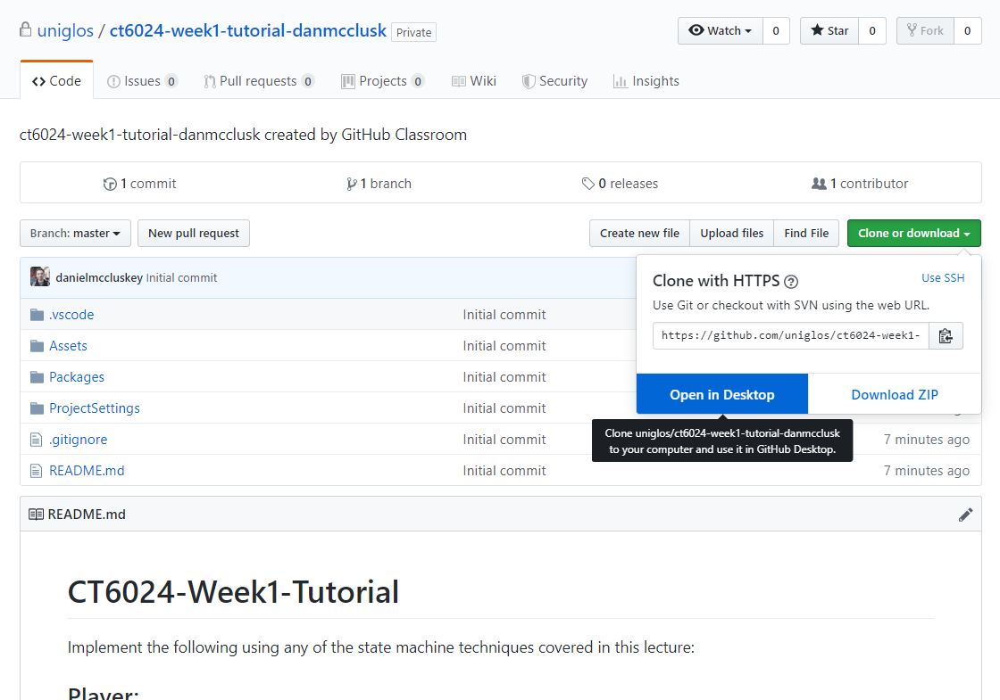
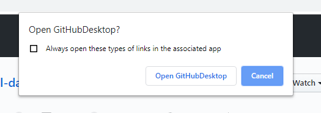
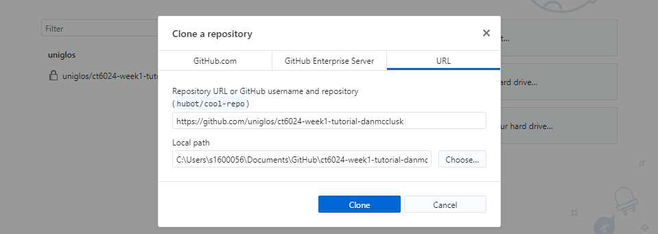
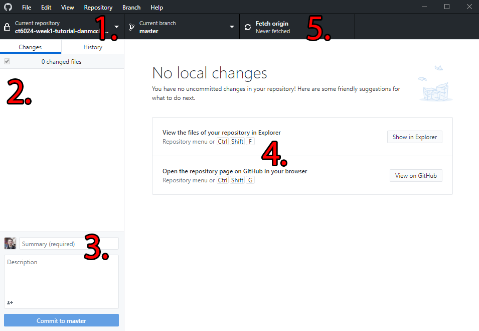
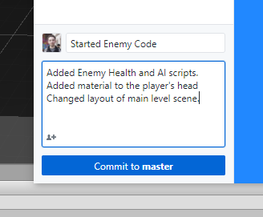
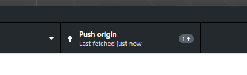
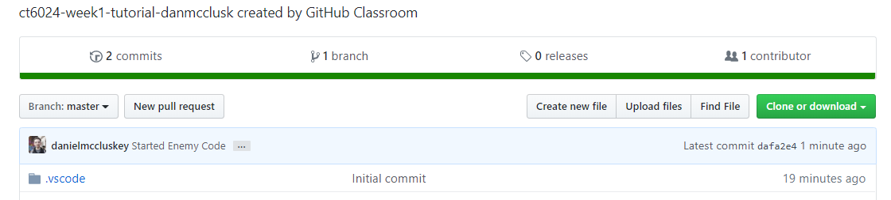

# How to use GitHub Desktop
This guide will give a brief overview of how to download and use GitHub desktop to save your work at different stages. 

A lot of the steps in this tutorial can be translated to other Git GUI Interfaces such as [Git Kraken](https://www.gitkraken.com/), [Git GUI](https://git-scm.com/downloads) etc. If you don't wish to use GitHub desktop, a comprehensive list of different GUI interfaces for Git can be found by [clicking here](https://git-scm.com/downloads/guis).

## Download
First of all, you will need to download GitHub desktop which you can do by [clicking here](https://desktop.github.com/). Once you have downloaded it, open the installer and follow the instructions.

## Cloning/Opening a repository
Go to the repository you wish to copy to your device and click on `Clone or Download` which is the green button, located on the upper-right side of the web page, then click on Open in Desktop.

## 
Depending on what browser you are using, you may get a pop-up box asking you to confirm whether or not you wish to open this link. On Google Chrome, this appears at the top of the screen in the middle. 

## 
When it opens in GitHub Desktop, you will be asked to choose where you want the repository to be cloned to. Once you have chosen a suitable directory, click on `Clone` at the bottom of the window.

## The Interface
When the repository successfully downloads, you will be met with an empty screen:

1. Repository Selector
    - This allows you to choose between the different repositories that you have on your device. Click on it to view a list of them.
2. File Changelist
     - This is the area which will show you the changes to your local repository that you have made since your last commit. 
3. Commit Description
     - This is where you can describe what you have done before you make your next commit.
     - When you commit, it will save the repository at that point so you can revert to it later. 
4. File Change overview
     - When you click on a file from the File changelist; the changes that you have made to that file will be displayed here
5. Fetch/Push button
     - This button is used to either Pull/Fetch from GitHub which syncs your repository with the one located on GitHub or it is used to Push your commits/changes to GitHub. 

## Committing your changes
It is a good idea to make regular commits so that you can save your work at different intervals, allowing you to revert to them if you make a mistake. So once you have made some changes, save your work and head back to GitHub Desktop.
Once it has refreshed you will see that your changes appear on the Changelist and that you can see the changes to each file.

If you do not wish to commit a file, you can either un-check it from the File changelist or Right click it and Ignore the file.

## 
When committing, you should make sure that your Commit summary and desctription actually tell you what changes you have made. This is good practice for work in the industry and also helps you find a commit if you ever need to revert. 
Some examples of **Bad** summaries would be `asdafdfsdsdcds` or `Fixed the Thing`. 

## 
Once you are happy with your commit description, you can go ahead and click `Commit to Master`. Once you have committed, you will need to `Push` that commit to GitHub, you can do this by clicking the `Push Origin` button at the top of the window.

## Checking it worked
You can check if your work was successfully uploaded by going to your repository in your preferred browser and checking the commit history, in the image below, you can see that the latest commit was the one we just pushed!

