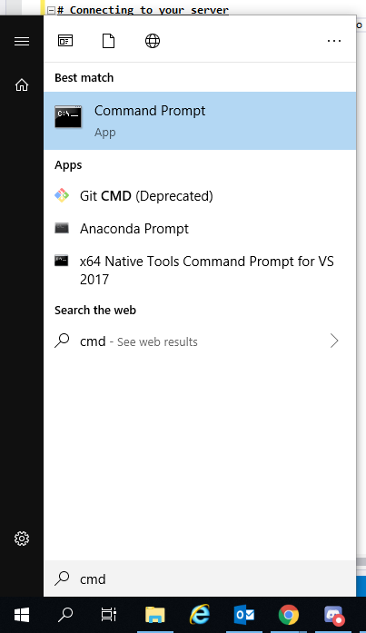

# Setting up an Amazon Server
This tutorial will go through how to set up an Amazon AWS server which you can use for training, or just general Python work. This will put the stress on to the servers CPU rather than yours and will allow you to leave your work running without having to leave your PC on overnight.

# Signing up
To sign up, you will need an Amazon AWS account, I recommend signing up for their education pack as they give you free CPU time each month. You can sign up by going to the [AWS Educate website](https://aws.amazon.com/education/awseducate/) and follow their signup process.

# Going to the Dashboard
Once you've signed up and have successfully logged in, you'll need to go to the AWS Dashboard, you can do this by clicking on AWS account in the top left and then clicking on _AWS Start Account_.

Afterwards, you'll just need to click on _AWS Console_

# Starting an EC2 Instance
Now we can finally setup an Amazon EC2 instance to run our server on. To do this click on **Compute->EC2**.

##### Creating the Instance
On the EC2 Dashboard, click on **Launch Instance**.

##### Selecting the OS
We can now select what Operating system we want our server to have, if you have experience with a certain OS and want to use it, go ahead! But for this tutorial, we will be using Ubuntu Server 18.04, so find that on the list and click select.

##### Selecting an Instance Type
Since at the start of the course we won't need much processing power, we can go ahead and choose the **t2.micro** as our Instance type. *This is also Free tier eligible!*

Since we don't need to fiddle with any other settings, you can now just go ahead and click **Review and Launch** at the bottom right of the screen.

##### Creating a Keypair
On the next screen, go ahead and click **Launch** at the bottom right of the screen. You will now be asked to create a new Keypair. This is a permission file that allows you to log in to your server from your personal computer. Give it an appropriate name, **Download it** and then **Create it**. You should then move this permission file to an easy to access location, I have moved mine to my User directory into a folder named `AWSPermissions`

After you have done that, your server will launch and will now be visible on the EC2 Dashboard. 

# Connecting to your server
To connect to your server you will first need to open a command prompt window. You can do this by going to your start menu, typing in `cmd` and opening a Command prompt window.

##### Copying your file path
You will then need to navigate to where your permissions file is located and then copy the path. You can do this by copying the Path from the windows explorer.

##### Getting there in the Command prompt
To change the working directory of the command prompt we will use the `cd` command (Change Directory). You will need to type in `cd` to the command prompt and then paste in your Path from the last step.

To paste in Windows 10, just right click anywhere on the Command window or press `Ctrl+V`, then go ahead an press enter!

It should look a little like this:

##### Connecting to your EC2 Instance
Now we are ready to connect, on your EC2 Instance list, right click on the instance you wish to connect to and click `Connect`, you will then be given a command which you can copy and paste into your Command window.

Copy the following line and paste it into your command window and hit enter!

##### ECDSA Fingerprint
If you get a warning about the ECDSA fingerprint, go ahead and type `yes` and hit enter.

# Setting up your server
For this course, you're going to need a few things to get a Jupyter Notebook up and running, so follow the steps below in order to install Anaconda onto your server.

##### Getting the latest version
This command will grab and download the latest version of Anaconda from the Anaconda website, paste it in and hit enter.

    wget https://repo.anaconda.com/miniconda/Miniconda3-latest-Linux-x86_64.sh

##### Changing the file permissions
We will then need to give the file permission to run, we can do this using the `chmod` command. 

    chmod +x ./Miniconda3-latest-Linux-x86_64.sh

##### Running the file
Since it is a shell script, to run the file, we just need to write out its name like so.

    ./Miniconda3-latest-Linux-x86_64.sh

Once you have run that, follow the installation process and allow everything to download, once it has finished, you will need to **Close your command window** and **Reconnect to your server**.

##### Setting up an environment
First we will setup a Conda environment for our work. Environments allow us to manage the libraries we install and keep them organised per project. 
To create an environment we can use the following command which will create a Python 3 environment called danspythonenv

 *Make sure to change the name of yours to something more appropriate!*

    conda create -n danspythonenv python=3

##### Activating that environment
To start using that environment, we first need to activate it. Do this by typing:

    conda activate danspythonenv

##### Installing packages
Now that we have activated our environment, we can start installing packages and libraries. The ones we will be using for this tutorial are `anaconda`, `pandas`, `numpy` and `matplotlib`.

Install these packages individually by using the following command (And replacing `PACKAGENAME` with each of the packages previously listed.)

    conda install PACKAGENAME

# Launching a Jupyter Notebook Session
To launch a Jupyter Notebook session, type in the following

    jupyter notebook --no-browser --port=8889

##### Connecting to it
To connect to it, you will need to create a Port tunnel between your PC and the server. Do this with the following command. *Make sure to use your server information!*

    ssh -N -f -L localhost:8888:localhost:8889 -i "DansAWSServer.pem" ubuntu@YOURSERVERADDRESSHERE

##### Opening the Jupyter Session
You can then open the Jupyter session by either going to [localhost:8888](http://localhost:8888) or by copying one of the links shown in the command window!

# Using your environment
Have a play around with everything and have a go at this weeks tutorial.